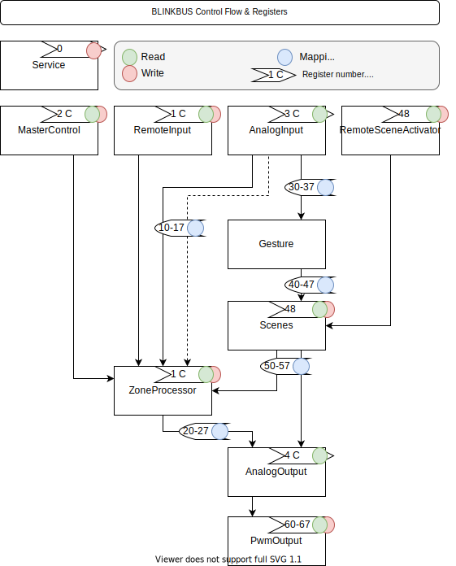

# blinkbus

## Мотивация

Мне нравится modbus. Нравится его концепция и простота. 
Мне нравится проводное подключение. Я не испытываю радиофобию, просто больше доверяю проводам.
Мне нравится децентрализованные и простые решения.
Я понимаю что по каждому пункту можно поспорить.

## Концепция

Каждый вход и выход, направление движение сигнала, промежуточное состояние, удалённое управление - всё можно контролировать через определённый регистр. Зашитая логика работы обеспечивает инструментарий. Конфигурация через регистры - взаимодействие инструментов.

Конечное исполнительное устройство, которое может контролировать назначенные ему зоны и сценарии не зависимо от присутствия внешнего управления. ~~Похоже я изобрёл ПЛК~~.

##Возможные сценарии использования

* Выключатель освещение с удалённым управлением
* Проходной выключатель на кнопке без фиксатора
* Одна кнопка на N каналов освещения
* Датчик движения который активирует приглушенное освещение 
* Датчик движения может быть удалённо заглушен (например по расписанию светового дня)
* Датчик движения может считываться удалённо даже если он заглушен (запись о том что кто-проходил в определённое время)
* Мастер включатель реализованный физически
* Мастер включатель активированный удалённо
* Пересекающиеся зоны освещения (один сенсор может подсвечивать несколько разных зон)
* Прямое управление pwm
* Удалённое управление во всех сценариях (например Home Assistant)

##Ограничения

Топология проводки. Проводка должна быть выполнена в виде лучей от распределительного шкафа до выключателей и ламп.

В данной реализации имеем всего по 8 штук. Входов, выходов, зон, сцен, жестов. На дом 100м2 придётся установить несколько устройств.

##Термины и блоки

* **Вход и выход** сигнала соотвествует конкретным пинам ардуино.
* **Уровень освещённости**. Для упрощения принято 4 уровня. Off, On и два промежуточных для работы с pwm.
* **Процессор зоны**. Блок который управляет поведением одной "зоны" освещения. Учитывает все входящие сигналы, хранит состояние и меняет его при необходимости.
* **Жест**. Определённая последовательность сигналов входа которая совпадает с заданными. Один клик. Двойной. Тройной. Долгий клик. Удерживание. Клик+Удерживание. При выполнении жеста может быть активирована сцена.
* **Сцена**. Заранее определённый набор зон или выходов.
* **Действие**. Действие применяется к сцене. Одна сцена может выполнятся с разными действиями. Включение. Выключение. Переключение. Ротация.

##Настройка

Настройка сценария работы производится с помощью установки значений в соотвествующие регистры. Большинство настроек выглядят как битовая маска, где каждый бит соотвествут каналу выхода.

Пример. Самый простой сценарий использования это сквозной проброс сигнала от входа к выходу. Такой маппинг выглядит как лесенка в битовом виде. На скриншотах ModbusPoll.
IMG

##Железо

Тестировалось только на Arduino Nano. 

Используемые библиотеки -> https://github.com/EngDial/ModbusTCP

