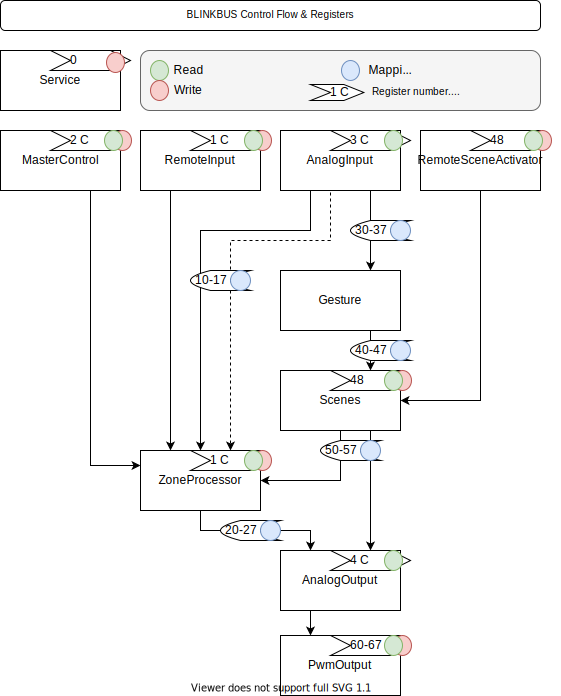

# blinkbus

## Motivation

I like modbus. I like its concept and simplicity. 
I like the wired connection. I don't feel radiophobia, I just trust the wires more.
I like decentralized and simple solutions.
I understand that you can argue on every point.

## Concept

Each input and output, the direction of movement of the signal, the intermediate state, remote control - everything can be controlled through a specific register. Application logic of the work provides the tools. Configuration via registers - interaction of tools.

An end-user device that can control the zones and scenarios assigned to it, regardless of the presence of external control. ~~It looks like I invented a PLC~~.

##Possible usage scenarios

* Turn off the lighting with remote control
* Pass-through switch on the button without a lock
* One button for N lighting channels
* Motion sensor that activates dim lighting 
* The motion sensor can be remotely muted (for example, according to the daylight schedule)
* The motion sensor can be read remotely even if it is muted (a record of someone passing at a certain time)
* Master switch implemented physically
* Master switch activated remotely
* Overlapping lighting zones (one sensor can illuminate several different zones)
* Direct PWM control
* Remote control in all scenarios (e.g. Home Assistant)

##Restrictions

Wiring topology. The wiring should be made in the form of beams from the switch cabinet to wall switches and lamps.

In this implementation, we have only 8 pieces each. Entrances, exits, zones, scenes, gestures. You will have to install several devices on a house of 100m2.

##Terms and blocks

* **The input and output of the** signal correspond to the specific pins of the arduino.
* **The level of illumination**. To simplify it, 4 levels are accepted. Off, On and two intermediate ones for working with pwm.
* **The processor of the zone**. A block that controls the behavior of one "zone" of lighting. It takes into account all incoming signals, sucks the state and changes it if necessary.
* **Gesture**. A certain sequence of input signals that matches the specified ones. One click. Double. Triple. A long click. Hold. Click+Hold. When performing a gesture, a scene can be activated.
* **Scene**. A predefined set of zones or exits.
* **Action**. The action is applied to the scene. One scene can be executed with different actions. Enabling. Shutdown. Switching. Rotation.

##Setting up

The operation scenario is configured by setting the values in the appropriate registers. Most settings look like a bit mask, where each bit corresponds to the output channel.

Example. The simplest use case is the end-to-end transmission of the signal from the input to the output. This mapping looks like a ladder in bitwise form. The screenshots show ModbusPoll software.
IMG

##Hardware

It was tested only on the Arduino Nano. 

Used modbus library -> https://github.com/EngDial/ModbusTCP

